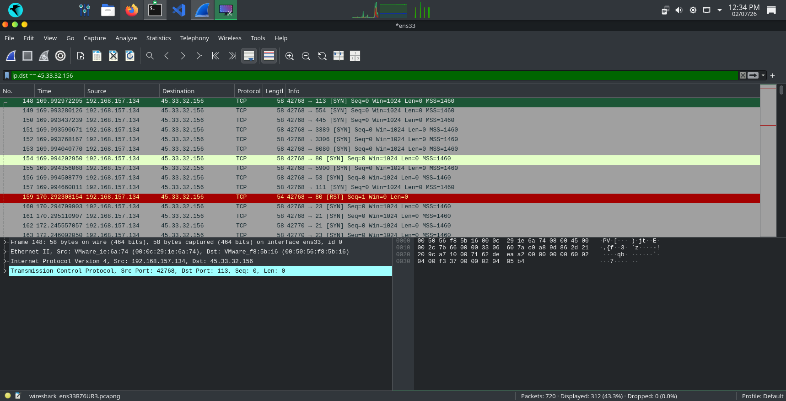

# Day 7: Wireshark + Nmap SYN Scan Analysis

## 🎯 Objective
Capture and analyze Nmap SYN scan traffic using Wireshark to understand port scanning behavior.

### 📝 Commands Used
1. Nmap SYN Scan
```bash
sudo nmap -sS -T4 -Pn --top-ports 100 45.33.32.156
```

## 🔍 Wireshark Analysis
**Display Filter:** `ip.dst == 45.33.32.156`
**Packets Captured:** 312 TCP SYN packets targeting scanme.nmap.org


## 🧠 Learning Outcome
1. Learned to capture live Nmap scan traffic with Wireshark
2. Used display filters to isolate scan packets from normal traffic
3. Understood TCP flags: SYN for scan, RST for closed ports
4. Essential SOC skill to detect reconnaissance activity

**Date:** 02-July-2026
**Status:** Day 7 Complete ✅
